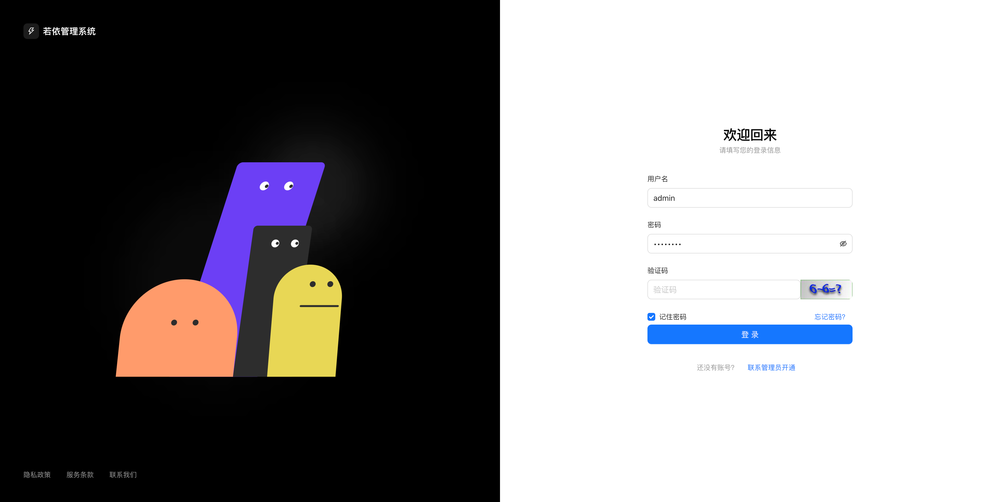
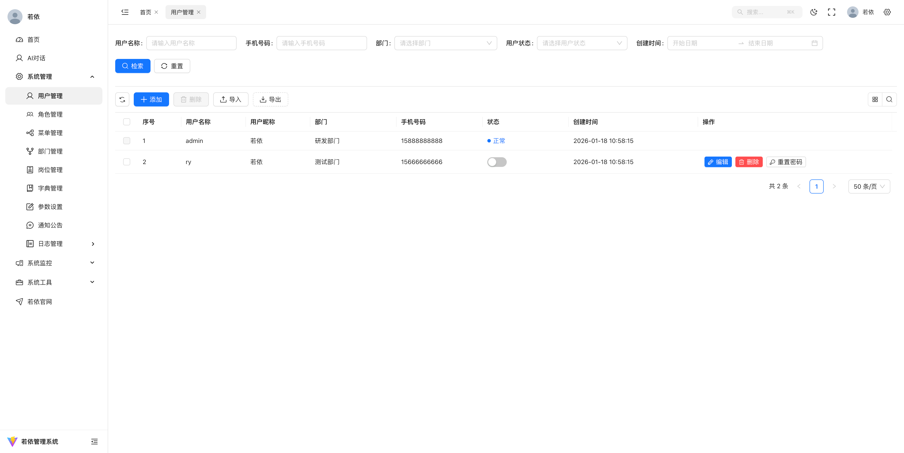
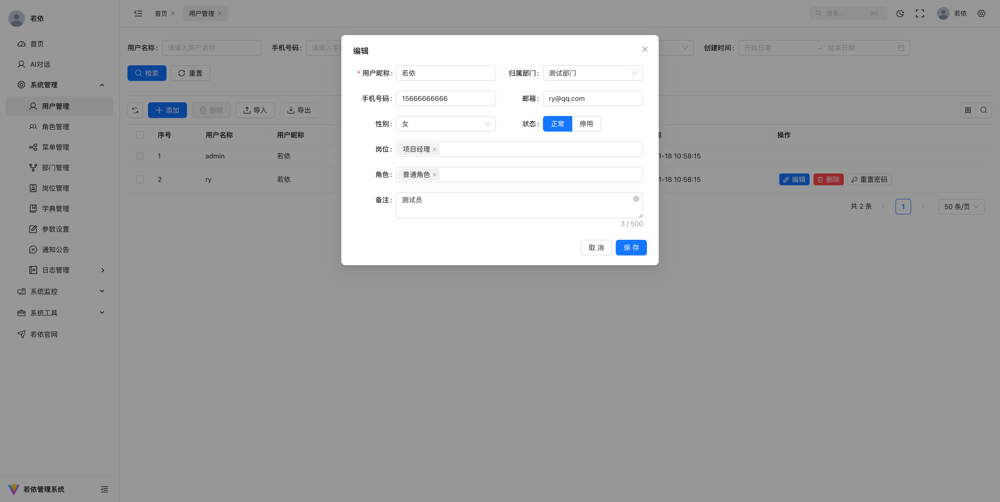
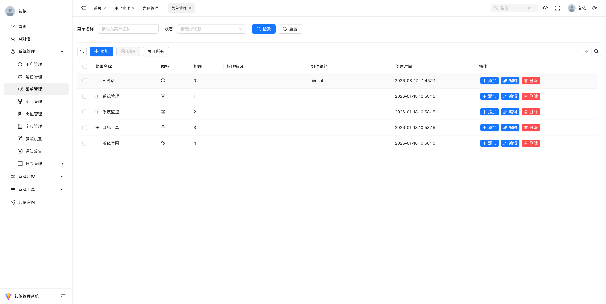
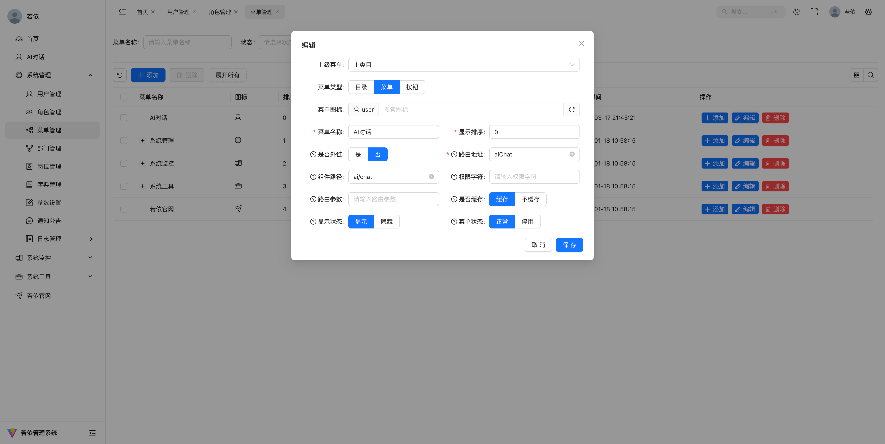
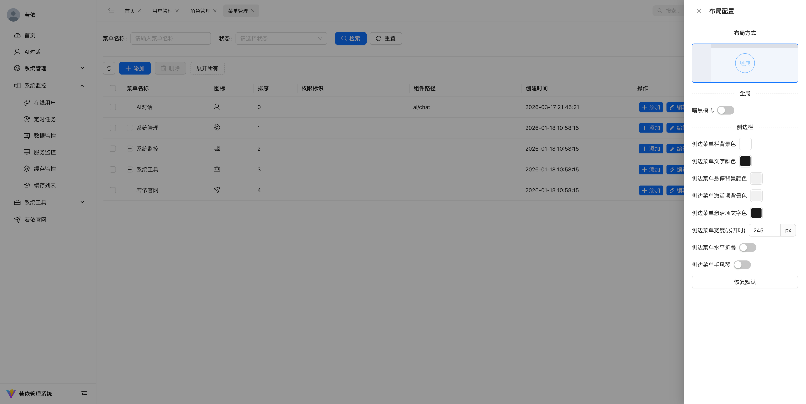
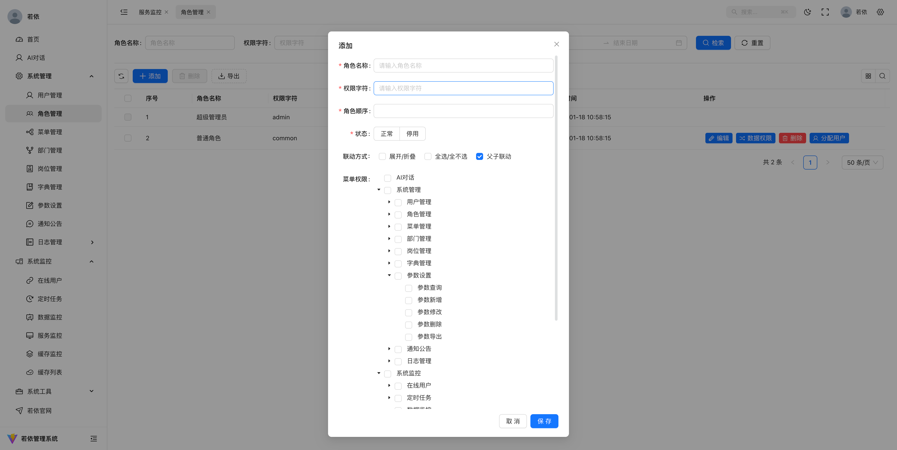
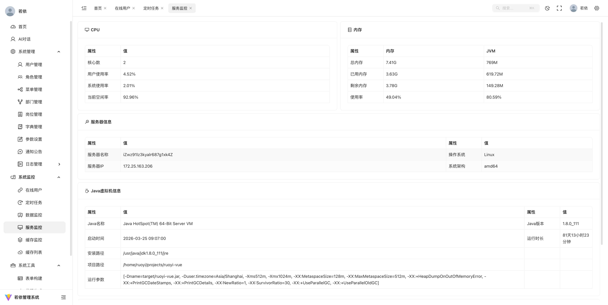

# 其他版本

| 版本               | 技术栈                      | 仓库                                                                                         |
| ------------------ | --------------------------- | -------------------------------------------------------------------------------------------- |
| ruoyi-vue3-lmw     | Vue 3 + JS + Element Plus   | [gitee.com/codelm/ruoyi-vue3-lmw](https://gitee.com/codelm/ruoyi-vue3-lmw.git)               |
| ruoyi-vue3-lmw-ts  | Vue 3 + TS + Element Plus   | [gitee.com/codelm/ruoyi-vue3-lmw-ts](https://gitee.com/codelm/ruoyi-vue3-lmw-ts.git)         |
| ruoyi-pritter-antd | Vue 3 + JS + Ant Design Vue | [github.com/w-yahaha/ruoyi-pritter-antd](https://github.com/w-yahaha/ruoyi-pritter-antd.git) |

# 演示图

<table>
  <tr>
    <td width="50%"></td>
    <td width="50%"></td>
  </tr>
  <tr>
    <td width="50%"></td>
    <td width="50%"></td>
  </tr>
  <tr>
    <td width="50%"></td>
    <td width="50%"></td>
  </tr>
  <tr>
    <td width="50%"></td>
    <td width="50%"></td>
  </tr>
</table>

# 联系本人

本人微信：di_huhu 
无需捐赠，如果觉得项目不错，或者已经在使用了，希望你可以去帮我点个 ⭐ Star。

# 组件使用说明

本文档介绍项目中六个核心基础组件的用法。其中 `BaseForm`、`BaseTable`、`PageContent`、`PageDialog`、`PageSearch` 已在 `main.js` 中全局注册，可直接在模板中使用；`BaseEchart` 需手动按需引入。

---

## 目录

- [BaseEchart](#baseechart)
- [BaseForm](#baseform)
- [BaseTable](#basetable)
- [PageSearch](#pagesearch)
- [PageContent](#pagecontent)
- [PageDialog](#pagedialog)
- [典型页面组合](#典型页面组合)

---

## BaseEchart

基于 ECharts 封装的图表组件，支持暗色主题切换、窗口自适应与 SVG 渲染。

### 引入方式

```js
import BaseEchart from '@/BaseComponent/BaseEchart/src/echart.vue'
```

> 注意：`BaseEchart` 未在 `main.js` 中全局注册，使用前需手动 import 并在组件中声明。

### Props

| 属性      | 类型     | 默认值    | 说明                         |
| --------- | -------- | --------- | ---------------------------- |
| `options` | `Object` | —         | **必填**，ECharts 标准配置项 |
| `width`   | `String` | `'100%'`  | 图表容器宽度                 |
| `height`  | `String` | `'300px'` | 图表容器高度                 |

### 特性

- 自动监听 `options` 变化并调用 `setOption`
- 跟随布局暗色模式（`layout.isDark`）自动切换 `customDark` 主题
- 窗口 resize 及 `height` 变化时自动 `resize`
- 默认使用 SVG 渲染、中文 locale

### 基础示例

```vue
<script setup>
import { ref } from 'vue'
import BaseEchart from '@/BaseComponent/BaseEchart/src/echart.vue'

const chartOptions = ref({
  tooltip: { trigger: 'item' },
  series: [
    {
      type: 'pie',
      radius: '60%',
      data: [
        { value: 1048, name: '搜索引擎' },
        { value: 735, name: '直接访问' },
      ],
    },
  ],
})
</script>

<template>
  <BaseEchart :options="chartOptions" height="400px" />
</template>
```

---

## BaseForm

配置驱动的表单组件，通过 `formItems` 数组描述表单项，内部基于 Ant Design Vue `a-form` 实现。

### Props

| 属性           | 类型                  | 默认值                            | 说明                                                    |
| -------------- | --------------------- | --------------------------------- | ------------------------------------------------------- |
| `data`         | `Object`              | —                                 | **必填**，表单数据对象（双向绑定各字段）                |
| `formItems`    | `Array`               | `[]`                              | 表单项配置数组                                          |
| `rules`        | `Object`              | `{}`                              | 校验规则，同 Ant Design Vue Form                        |
| `formConfig`   | `Object`              | `{}`                              | 透传给 `a-form` 的配置（默认开启 `scrollToFirstError`） |
| `colLayout`    | `Object`              | —                                 | 全局栅格布局，如 `{ xl: 6, lg: 8, xs: 24 }`             |
| `rowConfig`    | `Object`              | `{}`                              | 透传给 `a-row`                                          |
| `itemStyle`    | `Object`              | `{ padding: '0px 20px 0px 0px' }` | 表单项外层样式                                          |
| `footerLayout` | `Object`              | 见源码                            | `footer` 插槽所在列的栅格配置                           |
| `allDisabled`  | `Boolean`             | `false`                           | 是否禁用所有表单项                                      |
| `hideItems`    | `Array \| Ref<Array>` | `[]`                              | 需要隐藏的字段名列表                                    |

### Events

| 事件         | 参数                 | 说明                   |
| ------------ | -------------------- | ---------------------- |
| `keyUpEnter` | `{ event, current }` | 表单项内按下回车时触发 |

### Expose

| 方法/属性           | 说明                       |
| ------------------- | -------------------------- |
| `getFormValidate()` | 触发表单校验，返回 Promise |
| `formRef`           | 原生 `a-form` 实例         |
| `allRefs`           | 各表单项内部组件 ref 集合  |

### formItems 配置项

每个表单项常用字段：

| 字段             | 类型           | 说明                                  |
| ---------------- | -------------- | ------------------------------------- |
| `field`          | `String`       | **必填**，字段名，对应 `data[field]`  |
| `type`           | `String`       | 控件类型，见下方支持列表              |
| `label`          | `String`       | 标签文本                              |
| `config`         | `Object`       | 透传给对应 Ant Design Vue 控件的属性  |
| `options`        | `Array \| Ref` | 下拉/单选/多选等选项数据              |
| `layout`         | `Object`       | 单项栅格布局，优先级高于 `colLayout`  |
| `isHidden`       | `Boolean`      | 是否隐藏该项                          |
| `hideLabel`      | `Boolean`      | 是否隐藏标签                          |
| `tip`            | `String`       | 标签旁提示文字                        |
| `tipConfig`      | `Object`       | 提示 Tooltip 配置                     |
| `formItemConfig` | `Object`       | 透传给 `a-form-item`                  |
| `eventFunction`  | `Object`       | 绑定到控件的事件，如 `{ change: fn }` |
| `slotNames`      | `Array`        | 控件内部插槽名列表                    |
| `optionSlots`    | `Array`        | 选项插槽名列表                        |

### 支持的 type

| type           | 对应控件                                      |
| -------------- | --------------------------------------------- |
| `input`        | 输入框                                        |
| `inputNumber`  | 数字输入框                                    |
| `textarea`     | 文本域                                        |
| `select`       | 下拉选择（支持虚拟滚动）                      |
| `radio`        | 单选（配合 `isGroup: true`）                  |
| `checkbox`     | 多选                                          |
| `switch`       | 开关                                          |
| `datepicker`   | 日期选择（`config.range: true` 时为范围选择） |
| `cascader`     | 级联选择                                      |
| `treeSelect`   | 树形选择                                      |
| `tree`         | 树                                            |
| `autocomplete` | 自动完成                                      |
| `inputTag`     | 标签输入                                      |
| `custom`       | 自定义内容，使用 `{field}Custom` 插槽         |

### 插槽

| 插槽名                           | 说明                                    |
| -------------------------------- | --------------------------------------- |
| `{field}Header`                  | 表单项上方整行区域                      |
| `{field}CustomLabel`             | 自定义标签                              |
| `{field}Before` / `{field}After` | 控件前后内容                            |
| `{field}Custom`                  | `type: 'custom'` 时的自定义控件         |
| `{field}{SlotName}`              | 控件内部插槽（如 select 的 suffixIcon） |
| `{field}{SlotName}Option`        | 选项插槽                                |
| `footer`                         | 表单底部操作区（如搜索按钮）            |

### 基础示例

```vue
<script setup>
import { ref } from 'vue'

const formData = ref({
  postName: '',
  status: '0',
})

const formConfig = {
  formItems: [
    {
      field: 'postName',
      type: 'input',
      label: '岗位名称',
      config: { allowClear: true, maxlength: 30 },
    },
    {
      field: 'status',
      type: 'select',
      label: '状态',
      options: [
        { label: '正常', value: '0' },
        { label: '停用', value: '1' },
      ],
    },
  ],
  rules: {
    postName: [{ required: true, message: '不能为空', trigger: 'blur' }],
  },
  colLayout: { xl: 12, xs: 24 },
}

const formRef = ref()

const submit = async () => {
  await formRef.value.getFormValidate()
  // 提交 formData.value
}
</script>

<template>
  <BaseForm ref="formRef" :data="formData" v-bind="formConfig" />
</template>
```

---

## BaseTable

配置驱动的表格组件，封装 Ant Design Vue `a-table`、分页、多选、列拖拽缩放等能力。

### Props

| 属性               | 类型           | 默认值                                      | 说明                                                    |
| ------------------ | -------------- | ------------------------------------------- | ------------------------------------------------------- |
| `dataList`         | `Array`        | `[]`                                        | 表格数据                                                |
| `tableItem`        | `Array`        | `[]`                                        | 列配置数组                                              |
| `tableConfig`      | `Object`       | `{}`                                        | 透传给 `a-table`（如 `rowKey`、`defaultExpandAllRows`） |
| `tableListener`    | `Object`       | `{}`                                        | 表格事件回调，如 `{ selectionChange, change }`          |
| `listCount`        | `Number`       | `0`                                         | 总条数（分页用）                                        |
| `paginationInfo`   | `Object`       | `{ pageNum: 1, pageSize: 50 }`              | 分页信息，支持 `v-model:paginationInfo`                 |
| `pagination`       | `Boolean`      | `true`                                      | 是否显示分页                                            |
| `showIndex`        | `Boolean`      | `false`                                     | 是否显示序号列                                          |
| `showChoose`       | `Boolean`      | `false`                                     | 是否显示多选框                                          |
| `showExpand`       | `Boolean`      | `false`                                     | 是否启用展开行                                          |
| `border`           | `Boolean`      | `false`                                     | 是否显示边框                                            |
| `align`            | `String`       | `'left'`                                    | 默认列对齐方式                                          |
| `hideItems`        | `Array \| Ref` | `[]`                                        | 隐藏的列 prop 列表                                      |
| `maxTableHeight`   | `Number`       | —                                           | 表格最大高度，不传则自动计算                            |
| `selectionConfig`  | `Object`       | `{}`                                        | 多选配置，透传给 `rowSelection`                         |
| `paginationLayout` | `String`       | `'total, sizes, prev, pager, next, jumper'` | 分页布局                                                |

### Events

| 事件                    | 参数                    | 说明     |
| ----------------------- | ----------------------- | -------- |
| `update:paginationInfo` | `{ pageNum, pageSize }` | 分页变化 |
| `sortChange`            | `sorter`                | 排序变化 |

### Expose

| 方法/属性          | 说明                |
| ------------------ | ------------------- |
| `tableRef`         | 原生 `a-table` 实例 |
| `unFoldAll(flag?)` | 展开/折叠所有树形行 |

### tableItem 列配置

| 字段                 | 类型      | 说明                          |
| -------------------- | --------- | ----------------------------- |
| `prop`               | `String`  | **必填**，字段名              |
| `label`              | `String`  | 列标题                        |
| `slotName`           | `String`  | 自定义列插槽名                |
| `width` / `minWidth` | `Number`  | 列宽（有 width 时可拖拽缩放） |
| `fixed`              | `String`  | 固定列，如 `'right'`          |
| `align`              | `String`  | 列对齐                        |
| `ellipsis`           | `Boolean` | 是否省略，默认 `true`         |
| `hide` / `isHidden`  | `Boolean` | 是否隐藏                      |
| `isDict`             | `Boolean` | 在 PageContent 中自动渲染字典 |
| `merges`             | `Array`   | 多级表头子列配置              |
| `permission`         | `String`  | 列权限标识                    |

### 插槽

| 插槽名                       | 说明                                                                |
| ---------------------------- | ------------------------------------------------------------------- |
| `header`                     | 自定义整个表头工具栏                                                |
| `handleLeft` / `handleRight` | 表头左右操作区                                                      |
| `{slotName}`                 | 自定义列内容，作用域：`backData`（行数据）、`currentItem`（列配置） |
| `{slotName}Header`           | 自定义列头                                                          |
| `expand`                     | 展开行内容，作用域：`backData`                                      |
| `footer`                     | 自定义分页区域                                                      |

### 基础示例

```vue
<script setup>
import { ref } from 'vue'

const dataList = ref([{ postId: 1, postName: '董事长', status: '0' }])
const paginationInfo = ref({ pageNum: 1, pageSize: 50 })

const tableItem = [
  { prop: 'postName', label: '岗位名称', minWidth: 120 },
  { prop: 'status', label: '状态', slotName: 'statusSlot', minWidth: 100 },
  { prop: 'todo', label: '操作', width: 160, slotName: 'todo', fixed: 'right' },
]
</script>

<template>
  <BaseTable
    v-model:pagination-info="paginationInfo"
    :data-list="dataList"
    :table-item="tableItem"
    :list-count="100"
    :show-index="true"
    :table-config="{ rowKey: 'postId' }"
  >
    <template #statusSlot="{ backData }">
      {{ backData.status === '0' ? '正常' : '停用' }}
    </template>
    <template #todo="{ backData }">
      <a-button size="small" @click="console.log(backData)">编辑</a-button>
    </template>
  </BaseTable>
</template>
```

---

## PageSearch

搜索区域组件，内部使用 `BaseForm` 渲染搜索表单，通过事件总线与 `PageContent` 联动。

### Props

| 属性                 | 类型       | 默认值 | 说明                                                         |
| -------------------- | ---------- | ------ | ------------------------------------------------------------ |
| `searchConfig`       | `Object`   | —      | **必填**，同 BaseForm 配置（含 `formItems`、`colLayout` 等） |
| `pageName`           | `String`   | —      | **必填**，页面标识，需与 PageContent 保持一致                |
| `initSearch`         | `Object`   | `{}`   | 初始搜索值                                                   |
| `otherRequestOption` | `Object`   | `{}`   | 每次搜索额外携带的参数                                       |
| `showSearch`         | `Boolean`  | `true` | 是否显示检索/重置按钮                                        |
| `reset`              | `Function` | `null` | 自定义重置逻辑，不传则调用表单 `resetFields`                 |
| `cacheKey`           | `String`   | `''`   | 多 Tab 场景下的缓存 key                                      |

### Expose

| 方法/属性                 | 说明             |
| ------------------------- | ---------------- |
| `formData`                | 当前搜索表单数据 |
| `search(isReset?)`        | 手动触发搜索     |
| `setFormData(key, value)` | 设置单个字段值   |

### 通信机制

- 点击「检索」时，通过 `emitter.emit('search{pageName}Info', formData)` 通知 PageContent 拉取数据
- 搜索区域高度变化时，通过 `change{pageName}Size` 事件通知 PageContent 调整表格高度
- 显示/隐藏由 PageContent 工具栏的「展开/关闭搜索」按钮控制

### 配置示例

```js
// config/searchConfig.js
export default () => ({
  formItems: [
    {
      label: '岗位名称',
      field: 'postName',
      type: 'input',
      config: { allowClear: true },
    },
    {
      label: '状态',
      field: 'status',
      type: 'select',
      options: [],
      config: { allowClear: true },
    },
  ],
  colLayout: { xl: 6, lg: 8, xs: 24 },
})
```

```vue
<PageSearch
  ref="pageSearchRef"
  :pageName="pageName"
  :searchConfig="searchConfig"
/>
```

---

## PageContent

列表页核心组件，封装 `BaseTable` + 数据请求 + 增删改查工具栏，适用于标准 CRUD 页面。

### Props

| 属性                                  | 类型       | 默认值                                                   | 说明                                              |
| ------------------------------------- | ---------- | -------------------------------------------------------- | ------------------------------------------------- |
| `contentConfig`                       | `Object`   | —                                                        | **必填**，表格配置（见下方）                      |
| `pageName`                            | `String`   | —                                                        | **必填**，页面标识，对应 store 中的模块名         |
| `requestBaseUrl`                      | `String`   | `'/'`                                                    | 接口基础路径                                      |
| `requestUrl`                          | `String`   | `'list'`                                                 | 列表接口后缀                                      |
| `delUrl`                              | `String`   | `''`                                                     | 自定义删除接口                                    |
| `idKey`                               | `String`   | `''`                                                     | 行数据主键字段，默认取 `rowKey` 或 `{pageName}Id` |
| `autoSend`                            | `Boolean`  | `true`                                                   | 挂载后是否自动请求列表                            |
| `autoDesc`                            | `Boolean`  | `true`                                                   | 是否应用默认降序排序                              |
| `descConfig`                          | `Object`   | `{ orderByColumn: 'createTime', isAsc: 'desc' }`         | 默认排序参数                                      |
| `firstSendOption`                     | `Object`   | `{}`                                                     | 首次请求额外参数                                  |
| `otherRequestOption`                  | `Object`   | `{}`                                                     | 每次请求额外参数                                  |
| `tableListener`                       | `Object`   | `{}`                                                     | 表格事件，如 `selectionChange`                    |
| `tableSelected`                       | `Array`    | `[]`                                                     | 当前选中行                                        |
| `permission`                          | `Object`   | `{}`                                                     | 权限标识 `{ add, edit, del }`                     |
| `dictMap`                             | `Object`   | `{}`                                                     | 字典映射，配合 `isDict: true` 列使用              |
| `showEdit` / `showDelete`             | `Boolean`  | `true`                                                   | 是否显示行内编辑/删除按钮                         |
| `handleEditShow` / `handleDeleteShow` | `Function` | `() => true`                                             | 控制行内按钮显示                                  |
| `headerButtons`                       | `Array`    | `['refresh','add','delete','columnDisplay','comSearch']` | 工具栏按钮                                        |
| `tableHideItems`                      | `Array`    | `[]`                                                     | 隐藏列 prop 列表                                  |
| `maxHeightDecrement`                  | `Number`   | `0`                                                      | 表格高度额外减量                                  |
| `cacheKey`                            | `String`   | `''`                                                     | 多 Tab 缓存 key                                   |
| `piniaConfig`                         | `Object`   | 见源码                                                   | 列表数据解析配置                                  |

### contentConfig 结构

```js
export default () => ({
  tableItem: [
    { prop: 'postName', label: '岗位名称', minWidth: 100 },
    { prop: 'status', label: '状态', slotName: 'statusSlot', minWidth: 120 },
    {
      prop: 'todo',
      label: '操作',
      width: 200,
      slotName: 'todo',
      fixed: 'right',
    },
  ],
  tableConfig: {
    rowKey: 'postId',
    defaultSort: { field: 'createTime', order: 'descend' }, // 可选
  },
  showIndex: true,
  showChoose: true,
  pagination: true,
  defaultPageSize: 50, // 可选
  hideItems: [], // 可为 ref，动态隐藏列
})
```

### Events

| 事件                 | 参数             | 说明                             |
| -------------------- | ---------------- | -------------------------------- |
| `addClick`           | —                | 点击「添加」按钮                 |
| `editBtnClick`       | `(rowData, res)` | 点击行内「编辑」，已请求详情数据 |
| `beforeSend`         | `searchInfo`     | 列表请求前                       |
| `afterSend`          | `list`           | 列表请求成功后                   |
| `onChangeShowColumn` | `hiddenProps[]`  | 列显示配置变化                   |

### Expose

| 方法/属性                | 说明                             |
| ------------------------ | -------------------------------- |
| `finalSearchData`        | 当前完整查询参数（含分页、排序） |
| `refresh()`              | 刷新列表                         |
| `dataList`               | 当前表格数据                     |
| `deleteRow(row \| rows)` | 删除单行或多行                   |
| `editClick(row)`         | 触发编辑（会先请求详情）         |
| `baseTableRef`           | BaseTable 实例                   |

### 插槽

| 插槽名                       | 说明                              |
| ---------------------------- | --------------------------------- |
| `handleLeft` / `handleRight` | 工具栏左右自定义按钮              |
| `expand`                     | 展开行内容                        |
| `todoSlot`                   | 操作列额外按钮（在编辑/删除之前） |
| `{slotName}`                 | 自定义列内容                      |
| `{slotName}Header`           | 自定义列头                        |

### headerButtons 可选值

| 值              | 说明                      |
| --------------- | ------------------------- |
| `refresh`       | 刷新                      |
| `add`           | 添加                      |
| `edit`          | 编辑选中项（需选中 1 条） |
| `delete`        | 删除选中项                |
| `columnDisplay` | 列显示设置                |
| `comSearch`     | 展开/关闭搜索             |

### 使用示例

```vue
<script setup>
import getSearchConfig from './config/searchConfig'
import getContentConfig from './config/contentConfig'
import useDialog from '@/hooks/useDialog'

const pageName = 'post'
const pageSearchRef = ref()
const pageContentRef = ref()
const tableSelected = ref([])

const [dialogRef, infoInit, addClick, editBtnClick] = useDialog(
  null,
  null,
  '添加'
)

const tableListener = {
  selectionChange: (selected) => {
    tableSelected.value = selected
  },
}

const search = () => pageSearchRef.value?.search()
</script>

<template>
  <PageSearch
    ref="pageSearchRef"
    :pageName="pageName"
    :searchConfig="searchConfig"
  />

  <PageContent
    ref="pageContentRef"
    :pageName="pageName"
    :contentConfig="contentConfig"
    :tableListener="tableListener"
    :tableSelected="tableSelected"
    :permission="{
      add: 'system:post:add',
      edit: 'system:post:edit',
      del: 'system:post:remove',
    }"
    :requestBaseUrl="systemBaseUrl"
    @addClick="addClick"
    @editBtnClick="editBtnClick"
  >
    <template #statusSlot="{ backData }">
      <DictTag :options="sys_normal_disable" :value="backData.status" />
    </template>
  </PageContent>

  <PageDialog
    ref="dialogRef"
    :pageName="pageName"
    :dialogConfig="dialogConfig"
    :infoInit="infoInit"
    :search="search"
  />
</template>
```

---

## PageDialog

弹窗表单组件，内部使用 `BaseForm`，集成新增/编辑保存逻辑（通过 `businessStore` 调用接口）。

### Props

| 属性             | 类型               | 默认值    | 说明                                          |
| ---------------- | ------------------ | --------- | --------------------------------------------- |
| `dialogConfig`   | `Object`           | —         | **必填**，同 BaseForm 配置                    |
| `pageName`       | `String`           | —         | **必填**，页面标识                            |
| `infoInit`       | `Object`           | `{}`      | 编辑时的初始数据，为空则为新增模式            |
| `defaultData`    | `Object`           | `{}`      | 新增时的默认值                                |
| `otherInfo`      | `Object`           | `{}`      | 保存时额外合并的字段                          |
| `width`          | `String \| Number` | `'600px'` | 弹窗宽度                                      |
| `top`            | `String`           | `'7vh'`   | 弹窗距顶部距离                                |
| `maxHeight`      | `String \| Number` | `''`      | 内容区最大高度，不传则自动计算                |
| `idKey`          | `String`           | `''`      | 编辑时主键字段                                |
| `sendIdKey`      | `String`           | `''`      | 提交时使用的主键字段名                        |
| `requestBaseUrl` | `String`           | `'/'`     | 接口基础路径                                  |
| `search`         | `Function`         | `null`    | 保存成功后回调（通常传 PageSearch 的 search） |
| `beforeSaveFun`  | `Function`         | `null`    | 保存前异步钩子                                |

### Events

| 事件         | 说明                         |
| ------------ | ---------------------------- |
| `beforeSave` | 点击保存、校验通过后、请求前 |
| `closed`     | 弹窗关闭后                   |

### Expose

| 方法/属性                 | 说明          |
| ------------------------- | ------------- |
| `openModal()`             | 打开弹窗      |
| `setTitle(value)`         | 设置标题      |
| `dialogVisible`           | 弹窗显示状态  |
| `formData`                | 表单数据      |
| `setFormData(key, value)` | 设置单个字段  |
| `formRef`                 | BaseForm 实例 |

### 新增 / 编辑流程

推荐配合 `useDialog` Hook 使用：

```js
import useDialog from '@/hooks/useDialog'

const [dialogRef, infoInit, addClick, editBtnClick] = useDialog(
  () => {
    /* 新增打开前回调 */
  },
  () => {
    /* 编辑打开前回调 */
  },
  '添加岗位',
  '编辑岗位'
)
```

- **新增**：`addClick()` → 清空 `infoInit` → `openModal()`
- **编辑**：PageContent `@editBtnClick` → 赋值 `infoInit` → `openModal()`
- **保存**：自动校验 → 调用 `createDataAction` / `editDataAction` → 成功后执行 `search()` 并关闭

### dialogConfig 示例

```js
export default () => ({
  rules: {
    postName: [
      { required: true, message: '岗位名称不能为空', trigger: 'blur' },
    ],
  },
  formItems: [
    {
      field: 'postName',
      type: 'input',
      label: '岗位名称',
      config: { maxlength: 30 },
    },
    {
      field: 'postSort',
      type: 'inputNumber',
      label: '岗位顺序',
      config: { min: 0 },
    },
    {
      field: 'status',
      type: 'radio',
      label: '状态',
      isGroup: true,
      options: [],
    },
  ],
  colLayout: { span: 24 },
  formConfig: {
    layout: 'horizontal',
    labelCol: { style: { width: '80px' } },
  },
})
```

### 自定义插槽

PageDialog 会将所有插槽透传给内部 BaseForm，用法与 BaseForm 一致：

```vue
<PageDialog ref="dialogRef" :dialogConfig="dialogConfig" :pageName="pageName">
  <template #remarkCustom="{ backData }">
    <!-- type: 'custom' 时使用 -->
  </template>
</PageDialog>
```

---

## 典型页面组合

标准 CRUD 页面由三个组件 + 三个配置文件组成：

```
views/xxx/
├── index.vue              # 页面入口
└── config/
    ├── searchConfig.js    # PageSearch 配置
    ├── contentConfig.js   # PageContent 配置
    └── dialogConfig.js    # PageDialog 配置
```

### 数据流

```
PageSearch --(event bus)--> PageContent --(store.getList)--> 后端 API
                                |
                                v
                           BaseTable 渲染

PageContent @editBtnClick --> PageDialog --> store.create/edit --> search 刷新
```

### 字典联动

搜索/表单中的 `options: []` 可通过 `getComputedConfig(config, dictMap)` 自动注入字典数据：

```js
const dictMap = { status: sys_normal_disable }
const searchConfigComputed = computed(() =>
  getComputedConfig(searchConfig, dictMap)
)
```

表格列设置 `isDict: true` 并在 PageContent 传入 `dictMap`，可自动渲染字典文本；也可使用 `{slotName}` 插槽配合 `DictTag` 自定义展示。

---

## 注意事项

1. **pageName 一致性**：`PageSearch`、`PageContent`、`PageDialog` 的 `pageName` 必须相同，否则搜索与列表无法联动。
2. **rowKey / idKey**：确保 `contentConfig.tableConfig.rowKey` 与后端主键字段一致，否则编辑、删除无法正确取 id。
3. **权限控制**：`permission` 对象中的值对应后端权限字符串，配合 `hasPermi` 控制按钮显示。
4. **列显示缓存**：列显示/排序偏好会持久化到 localStorage，key 为 `pageName`。
5. **BaseEchart 按需引入**：图表组件未全局注册，且 `index.js` 为空，请直接从 `src/echart.vue` 引入。
